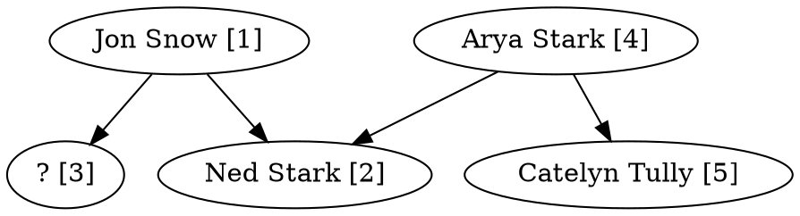

# Family Trees

[](https://en.wikipedia.org/wiki/C_(programming_language))
[]()
[]()
[]()
[]()

## Overview

This project implements a dynamic family tree management program written in C. It was developed as a university assignment by a team of **three students**, focusing on dynamic memory structures and graph traversal techniques. The user can input, manipulate, and visualize family relationships using commands via a console interface or by importing/exporting DOT files (used for graph representation).

## Features

- **Add Person**: Add a new person with a unique ID to the tree.
- **List People**: Display all persons and their IDs, indicating disconnected nodes.
- **Connect**: Define parent or grandparent relationships between people.
- **Rename**: Change the name of a person by ID.
- **Delete**: Mark a person as unknown ("?") without removing structure.
- **Draw Tree**: Export full or partial family tree to DOT file.
- **Relationship Check**: Check if and how two people are related.
- **Prune**: Remove unknown leaves with no connections.
- **DOT Import**: Load existing trees from DOT files.
- **DOT Export**: Save current tree to DOT format (Graphviz-compatible).

## Learning Objectives

- Dynamic memory management (heap)
- String manipulation and tokenization
- Structs and linked data structures
- Directed graph traversal (BFS)
- File I/O with parsing and formatted output

## How to Run

Compile with:

```bash
gcc -o assignment *.c
```

Run with:

```bash
./assignment             # Start with empty tree
./assignment input.dot   # Load from DOT file
```

## Command Summary

| Command                        | Description |
|-------------------------------|-------------|
| `help`                        | Show help message |
| `add <name>`                  | Add a new person |
| `list`                        | List all persons with IDs |
| `connect <id1> <relation> <id2>` | Define a relationship between two people |
| `rename <id> <new name>`      | Rename a person |
| `delete <id>`                 | Mark person as "unknown" |
| `draw-all [filename]`         | Print all trees or export to DOT file |
| `draw <id> [filename]`        | Print/export ancestors of a person |
| `relationship <id1> <id2>`    | Check relationship between two people |
| `prune`                       | Remove unconnected unknown nodes |
| `quit`                        | Exit the program |

## DOT File Format

The program supports importing/exporting trees using the DOT language.

Example:



Exported trees can be visualized using [Graphviz](https://graphviz.org/):

```bash
dot -Tpng output.dot -o tree.png
```

## Technical Highlights

- **Modular Design**: Code split into `main`, `filehelper`, `tree`, and `utility` modules.
- **Memory Safe**: All allocations checked, freeing done recursively.
- **Graph Traversal**: BFS used to locate nodes, check ancestry, build DOT files.
- **Custom Structs**:
  - `Person`: Represents an individual.
  - `RootsArray`: Manages root nodes (entry points).
  - `Queue`: Used for traversal.
- **Robust Input Parsing**: Handles command inputs with flexible spacing, names with spaces, and multi-word arguments.

## Return Codes

| Code | Meaning |
|------|---------|
| 0    | Success |
| 1    | Error opening file |
| 2    | Invalid usage |
| 3    | Memory allocation error |
| 4    | Invalid parameter |
| 5    | Relationship already exists |
| 6    | Person not found |

## Project Structure

```text
.
├── assignment.c      # Main entry point
├── filehelper.c/h    # DOT file parsing and export
├── tree.c/h          # Tree data structure and logic
├── utility.c/h       # Common helpers
├── Makefile          # (if applicable)
└── README.md         # This file
```

## License

This project is for academic purposes. Use freely under the MIT License.
